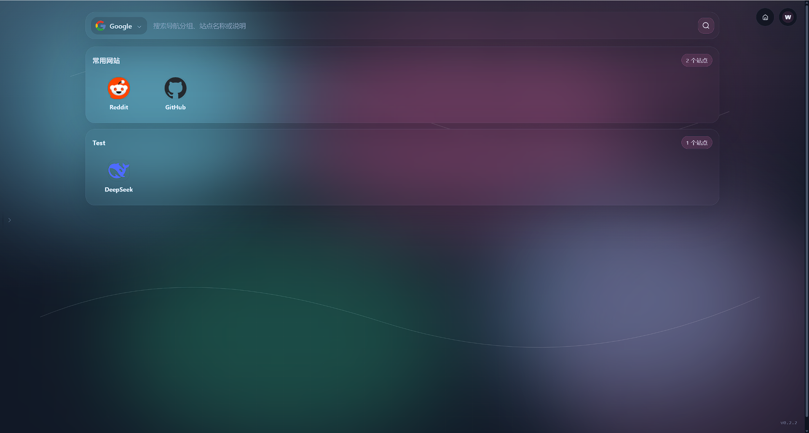

# Navix

Navix 是一个面向个人、团队和自托管场景的导航主页。它可以把常用网站、内网服务、管理后台和搜索入口整理到一个干净的启动台里，并通过服务端在多台设备之间同步。

你可以把 Navix 当作：

- 桌面上的个人导航面板
- 家庭服务器、NAS、Homelab 的入口页
- 团队内部系统的统一入口
- 同时支持公网地址和局域网地址的书签管理工具

## 界面预览

### 桌面客户端


桌面端适合作为日常入口，支持本地数据、账户切换、内网/公网模式、主题切换和自动更新。

### 服务端 Web 页面



Web 端由服务端直接分发，适合放在浏览器首页、团队入口页或自托管服务导航页中使用。

## 主要特点

### 一处管理常用入口

- 按分组整理网站和服务。
- 支持拖拽排序，让常用入口保持顺手的位置。
- 支持站点图标、标题、描述和地址管理。
- 支持浏览器书签导入，减少迁移成本。

### 同时照顾公网和内网

很多服务在外网和内网访问地址不同。Navix 支持为同一个站点配置公网地址和局域网地址，并在使用时切换访问模式。

### 桌面端和 Web 端都能用

- 桌面端适合日常使用，支持本地数据、托盘、主题、多语言和自动更新。
- Web 端由服务端内嵌分发，适合在浏览器中访问或作为团队入口页。

### 多账户和多设备同步

Navix 服务端负责账号管理和数据同步。管理员创建账号后，用户可以在桌面端登录并同步导航数据、分组、搜索引擎和图标。

### 自托管友好

服务端可以用 Docker 快速部署，数据保存在挂载目录中，便于备份和迁移。

## 快速开始

### 1. 启动服务端

使用 Docker 运行：

```bash
docker run -d \
  --name navix-server \
  --restart unless-stopped \
  -p 9990:9990 \
  -v navix-data:/data \
  guowenju/navix-server:latest
```

启动后访问：

```text
http://服务器地址:9990
```

第一次打开时，页面会引导你初始化管理员账号。普通用户账号由管理员在 Web 管理界面创建。

### 2. 使用桌面端

从 GitHub Release 下载适合你系统的 Navix 桌面端安装包：

- [Navix Releases](https://github.com/guowenju/navix/releases)

安装后可以先匿名使用本地导航，也可以在设置中填写服务端地址并登录账号，开启跨设备同步。

### 3. 添加导航入口

登录后可以：

- 创建网站分组。
- 添加常用网站或内网服务。
- 为站点配置公网地址和局域网地址。
- 导入浏览器书签。
- 在桌面端与服务端之间同步数据。

## Docker Compose

```yaml
services:
  navix-server:
    image: guowenju/navix-server:latest
    container_name: navix-server
    restart: unless-stopped
    ports:
      - "9990:9990"
    volumes:
      - ./data:/data
```

数据会保存在 `./data`：

- 数据库：`./data/database/navix-server.db`
- 服务端实例标识：`./data/server_instance.uuid`
- 图标文件：`./data/storage/user_icons`

`server_instance.uuid` 会参与客户端账号绑定和同步校验，请和数据库一起备份。

## 启用 HTTPS

如果你希望服务端直接提供 HTTPS，可以挂载证书并启用 HTTPS 参数：

```bash
docker run -d \
  --name navix-server \
  --restart unless-stopped \
  -p 9990:9990 \
  -p 9991:9991 \
  -v navix-data:/data \
  -v /path/to/certs:/certs:ro \
  guowenju/navix-server:latest \
  --enable-https \
  --cert-path /certs/fullchain.pem \
  --key-path /certs/privkey.pem
```

也可以把 Navix 放在反向代理后面，由 Nginx、Caddy、Traefik 等组件负责 HTTPS。

## 本地数据

桌面端默认把数据保存在用户目录下：

```text
~/.vust/navix
```

其中包括本地数据库、配置文件和图标缓存。删除账号本地数据时，Navix 会清理该账号关联的数据。

## 开发者信息

Navix 是一个 monorepo：

```text
apps/client        桌面端
apps/server        服务端
apps/server/web    服务端内嵌 Web 端
packages/shared-*  共享类型、工具和 UI
```

常用开发命令：

```bash
pnpm install
pnpm tauri dev
pnpm server:dev
```

校验命令：

```bash
pnpm format:all
pnpm check:all
cargo test --workspace
```

## 文档

- [更新日志](CHANGELOG.md)
- [客户端文档](docs/client-app.md)
- [服务端文档](docs/server.md)
- [可观测性规范](docs/observability.md)
- [Telemetry / 日志规范](docs/telemetry-logging-spec.md)

## 许可证

Navix 使用 MIT 许可证发布。
